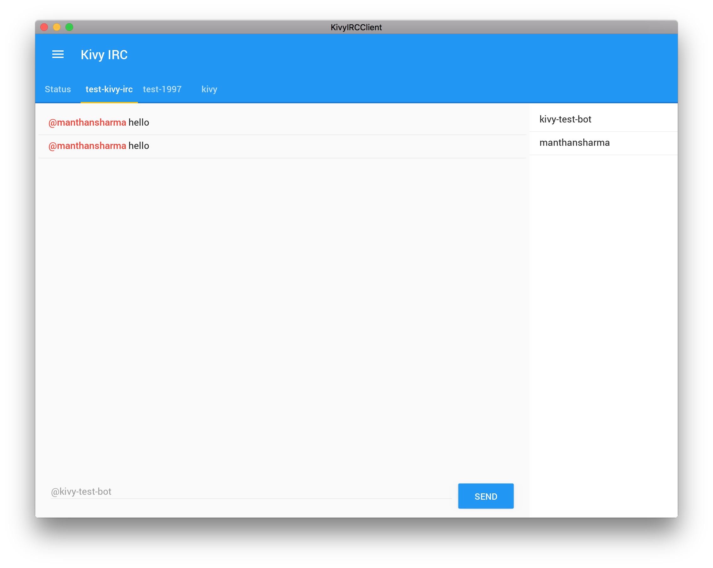

# Kivy IRC

App for you to connect to IRC World!

## Setup
1. Update kivyircclient.ini and set your nickname and channel.

## Screenshots

## Used libraries
* [Kivy](https://github.com/kivy/kivy)
* [Twisted](https://github.com/twisted/twisted)
* [KivyMD](https://gitlab.com/kivymd/KivyMD)

## Licence
The MIT License (MIT)